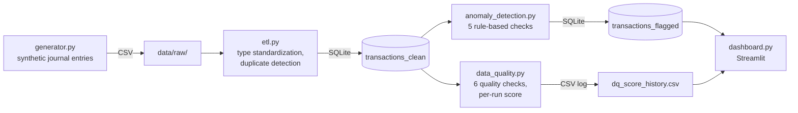

# Financial Data Quality & Anomaly Detection Pipeline

A small, self-contained data engineering and analytics pipeline that generates
synthetic financial transactions (journal entries), runs them through an ETL
process, checks data quality, and flags anomalous transactions using rule-based
detection — with a Streamlit dashboard for exploration.

The project is inspired by the kind of data work done in **audit technology /
digital audit innovation** teams: taking messy transactional data from
enterprise systems, harmonizing it, and identifying transactions that warrant
closer review.

---

## Data Flow



Each stage is a standalone, runnable script with a single responsibility.

---

## Project Structure

```
audit-data-quality-pipeline/
├── .github/workflows/ci.yml     # GitHub Actions: runs pytest on every push
├── src/
│   ├── generator.py             # synthetic transaction data generator
│   ├── etl.py                   # extract, standardize, detect duplicates, load to SQLite
│   ├── data_quality.py          # data quality checks + per-run score log
│   ├── anomaly_detection.py     # rule based anomaly detection
│   ├── dashboard.py             # Streamlit dashboard
├── tests/                       # pytest unit tests
├── data/                        # generated locally, not committed (see .gitignore)
│   ├── raw/                     # generator.py output
│   └── processed/               # SQLite DB + data quality score log
├── requirements.txt             # runtime dependencies
├── requirements-dev.txt         # + pytest, for running the test suite
├── pytest.ini                   # pytest config (pythonpath, test discovery)
└── README.md
```

---

## Setup

```bash
git clone <https://github.com/lukebaumCS/audit-data-quality-pipeline.git>
cd audit-data-quality-pipeline

python -m venv .venv
source .venv/bin/activate        # Windows: .venv\Scripts\activate

pip install -r requirements.txt
pip install -r requirements-dev.txt   # only needed to run tests
```

---

## Usage
 
The pipeline stages depend on each other's output and must be run **in order,
from the project root**, as modules (`python -m src.<module>`) rather than as
plain scripts — internal imports between modules (e.g. `data_quality.py`
importing config from `generator.py`) rely on `src` being treated as a
proper package:
 
```bash
python -m src.generator          # -> data/raw/transactions.csv
python -m src.etl                # -> data/processed/transactions.db (table: transactions_clean)
python -m src.data_quality       # -> data/processed/dq_score_history.csv
python -m src.anomaly_detection  # -> data/processed/transactions.db (table: transactions_flagged)
python -m streamlit run src/dashboard.py   # opens the dashboard in your browser
```
 
Or run the whole pipeline in one go with [`run_pipeline.sh`](./run_pipeline.sh):
 
```bash
./run_pipeline.sh
```
 
All scripts accept CLI flags to override default paths and parameters, e.g.:
 
```bash
python -m src.generator --n-records 50000 --anomaly-rate 0.05 --seed 1
```
 
Run `python -m src.<module> --help` for the full list of options on any
script.
 
---


## Methodology

### 1. Synthetic Data Generation (`generator.py`)
Generates ~100,000 journal entries (booking date, account, contra account,
amount, currency, cost center, clerk, text, payment type) using `Faker`, with
a configurable set of injected anomalies and a **ground-truth label**
(`is_anomaly`, `anomaly_type`) per row, enabling later evaluation against
known outcomes.

Injected anomaly types: duplicate transactions, unusually high amounts,
suspiciously round amounts, weekend/night postings, unusual account–clerk
combinations, and missing required fields.

### 2. ETL (`etl.py`)
Extract → Transform → Load. Reads the raw CSV (with explicit `dtype`
overrides so numeric-looking IDs like account codes aren't coerced to
floats), standardizes types, flags duplicate transactions based on business
key fields (account, contra account, amount, cost center, clerk, booking
date) and writes the result to a local SQLite database.

### 3. Data Quality (`data_quality.py`)
Runs six independent checks per transaction: completeness, duplicates,
valid dates, valid amounts, valid accounts (against the known chart of
accounts), and field consistency and aggregates them into a per run
Data Quality Score, logged over time in `dq_score_history.csv`.

### 4. Rule-Based Anomaly Detection (`anomaly_detection.py`)
Five explainable, independently-configurable rules:

| Rule | Logic |
|---|---|
| Duplicate transactions | Reuses ETL's business-key duplicate flag |
| Weekend / night postings | Booking outside Mon–Fri, 06:00–20:00 |
| Round amounts | Amount ≥ €500 and evenly divisible by €500 |
| Unusually high amounts | Amount above the 99th percentile |
| Unusual account–clerk combinations | Data-driven: flags account/clerk pairs that occur in less than 2% of that clerk's transactions learned from the data itself, not from any generator internal mapping |

Each flagged transaction records *which* rule(s) fired, laying the
groundwork for a weighted Risk Score in a later phase. An informal
comparison against the generator's ground truth label is printed after each
run for development time sanity checking (not a substitute for a formal
precision/recall evaluation).

### 5. Dashboard (`dashboard.py`)
A Streamlit app showing transaction volume, flagged anomaly count and rate,
current Data Quality Score, anomalies broken down by rule, anomaly trend
over time, top flagged transactions, and the Data Quality Score history
across runs.

---

## Testing & CI

```bash
pytest -v
```

Tests live in `tests/` and import the pipeline modules as `src.<module>`
(see `pytest.ini`, which adds the project root to `pythonpath`).

Every push and pull request against `main` automatically runs the full test
suite via GitHub Actions (`.github/workflows/ci.yml`).

---

## License

See [`LICENSE`](./LICENSE).
